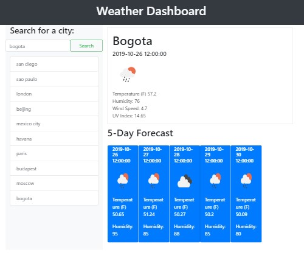

# Weather Dashboard

**Motivation**
This is a weather dashboard that was built as a project for the UCSD web development bootcamp program. This application allows a user to search for any city in the world and it will return real time weather conditions in that city, as well as a 5-day weather forecast. The application relys on the Open Weather API to access the weather data.

**Build status**

The build status is complete.

**Code style**

The application is written in JavaScript and uses the jQuery library for traversing the DOM.

**Screenshots**



**Code Example**

```javascript
//Run search on click
$("#run-search").on("click", function(event) {
  event.preventDefault();
  var userInput = $("#city-search").val();
  checkValidity(userInput);
  console.log("This is the user input:" + userInput);
});

$(".search").on("click", function(event) {
  event.preventDefault();
  var searchHistory = $(this).text();

  console.log(searchHistory);
  buildAPICall(searchHistory);
});
//Check weather the search term passed by the user is valid for the API call
function checkValidity(userInput) {
  if ((userInput === null) | (userInput === "")) {
  } else {
    //Call the APIs
    buildAPICall(userInput);
    userSearchArray.push(userInput);
    localStorage.setItem("userInputStorage", JSON.stringify(userSearchArray));
    console.log(userSearchArray);
    var newButton = $("<button>");
    newButton.addClass("search list-group-item list-group-item-action");
    newButton.text(userInput);
    $("#search-list").append(newButton);
  }
}
```

**Installation**

No installation necessary. Project is hosted here:
